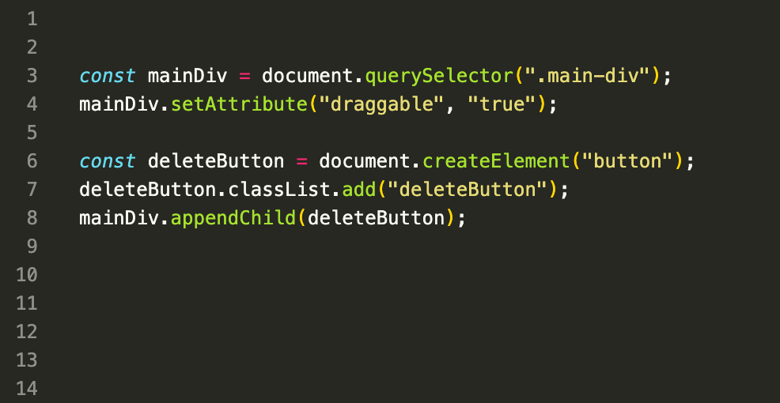
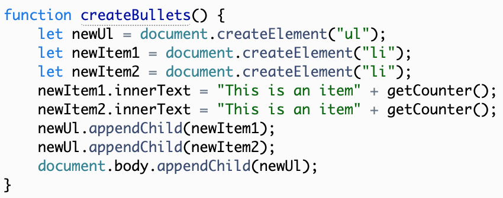
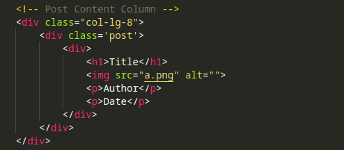
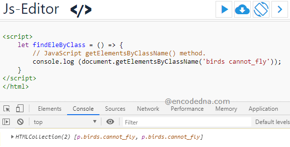
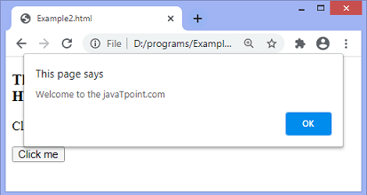
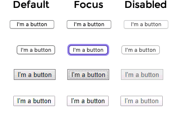

# DOM
### The backbone of an HTMLdocument is tags. According to the Document Object Model (DOM), every HTML tag is an object. Nested tags are “children” of the enclosing one. The text inside a tag is an object as well.
```HTML
<!DOCTYPE html>
<html lang="en">
<head>
    <meta charset="UTF-8">
    <meta http-equiv="X-UA-Compatible" content="IE=edge">
    <meta name="viewport" content="width=device-width, initial-scale=1.0">
    <title>Document</title>
</head>
<body>
    <div>
        <label for="">
            <input type="text" name="" id="">
        </label>
    </div>
</body>
</html>
```

# document.querySelector(...)
### We can get elements by class id or tag itself with "document.querySelector(...)" method!
```JS
    let list = document.querySelector(".list")
    console.log(list)
    // <ul><>
```

# document.createElement(....)
### We can create element with createElement method like div, ul, h1,....
```JS
    
    let li = document.createElement("li");
    console.log(li);
    //Creating  <li></li>
```

# document.appendChild(....)
### We can say like this element belongs to another one by appendChild() method
```JS
    let list = document.querySelector(".list")
    list.appendChild(li)
    // list = <ul><li></li></ul>
```


# DOM - Searching: Styles and classes
### We can add to some new things using document.(...).classList.add("some class")
### We can see class name using document.(..).className();
```HTML
    <body class="main page">
    <script>
        document.body.classList.add("Hello")
        alert(document.body.className);
    </script>
</body>
```

# Introduction to browser events
### Every move in our browser we call them browser events like click, appearing, scrolling....
### Methods onclick it is like an event. When we click on button it will do something like adding or removing appearing....
```JS
    let btn = document.querySelector(".btn") //button
    let sp =  document.querySelector(".sp") //+
    let cnt = 0;
    btn.onclick = () =>{
        cnt++;
        sp.innerHTML = cnt;
    }
```

# Forms, controls
### The change event triggers when the element has finished changing.
### For text inputs that means that the event occurs when it loses focus.
### For instance, while we are typing in the text field below – there's no event. But when we event: move the focus somewhere else, for instance, click on a button – there will be a change

```HTML
     <form>
        <label for="name">Name:
            <input type="text" name="name" class="forward" required>
        </label><br>
        <label for="Surname">Surname:
            <input type="text" name="Surname" required class="forward1">
        </label><br>
    </form>
```
```JS
form.onsubmit = (event) => {
    event.preventDefault()
    let obj = {
        name : event.target['name'].value,
        Surname : event.target["Surname"].value,
        Email : event.target["Email"].value,
        Gender: event.target["Gender"].value,
        Password:event.target["Password"].value
    }
    console.log(obj)
    form.reset();
}
```
